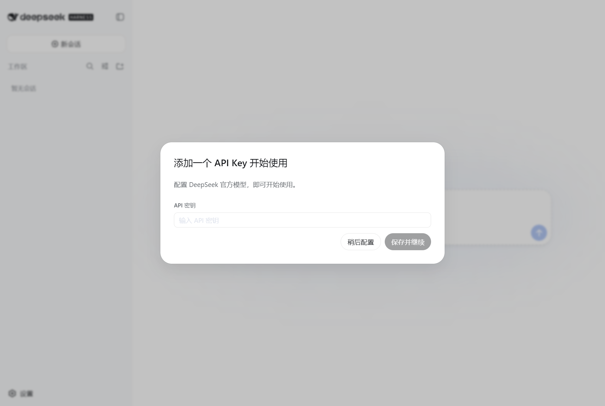

# TDSH — 团团的 DeepSeek 桌面壳

> **T** = 团团（开发者）· **DSH** = DeepSeek Harness
> 把 DeepSeek Harness 的 Web 界面装进一个原生桌面窗口。双击即用，无需浏览器。

[](LICENSE)

## 这是什么

TDSH 是 [DeepSeek Harness](https://github.com/deepseek-ai/deepseek-harness) 的轻量 Electron 桌面壳：

- 原生窗口承载 DSH Web GUI（Electron 33，无边框深色风格）
- **attach-or-spawn**：检测本地 `dsh web` 是否已运行——已运行则直接开窗复用；未运行则自动拉起一个新实例
- **Hanako 式窗口交互**：对话头部即拖拽区、右上角圆角胶囊内嵌最小化/最大化/关闭三键（替换并隐藏了原 "Session log" 按钮，功能未删，可配置恢复）
- 单实例锁、外链走系统浏览器、关闭窗口自动回收服务进程
- **磁盘友善**：userData / Chromium 缓存 / 日志全部落在应用所在目录，不写系统盘（可用环境变量重定向）

## 截图



## 快速开始

前置：能跑 `dsh web` 的 DeepSeek Harness 环境（Node.js ≥ 20）。

```bash
git clone https://github.com/tuantuan0218/TDSH.git
cd TDSH
pnpm install        # 安装 electron（安装期缓存可用 ELECTRON_CACHE 等重定向到任意目录）
pnpm start          # 启动桌面端
```

### 环境变量（可覆盖）

| 变量 | 默认 | 说明 |
|---|---|---|
| `DSH_REPO` | 由仓库位置推断 | DSH 源码根（`apps/cli/src/bin.ts` 所在） |
| `DSH_HOME` | 继承环境 | DSH 数据主目录（sessions / settings / storages） |
| `DSH_NODE` | `node`（PATH） | 启动 `dsh web` 用的 Node 可执行文件 |

### 行为

1. 启动探测 `http://127.0.0.1:3080`：已活 → 开窗 **attach**；未活 → spawn `dsh web --port 0`，从 stdout 解析真实 URL 后开窗
2. 单实例锁；关闭窗口 → 结束并回收自起服务
3. 右上角胶囊内：最小化 / 最大化 / 关闭（关闭红态悬停）
4. 对话头部 = 拖拽区（内部按钮仍可点击）；非对话页回退为顶部 8px 隐形拖拽带
5. 运行日志：应用目录下 `app.log`

## 配置

`config.json`（应用目录内）：

```jsonc
{ "hideSessionLog": true }  // true = 隐藏 GUI 原 "Session log" 按钮（其位置变成窗口控制键）
```

## 开发钩子（验证用）

| 环境变量 | 行为 |
|---|---|
| `DSH_CAPTURE=1` | GUI 加载后截图 `capture.png` 并退出 |
| `DSH_MORPHCHECK=1` | 输出 preload 注入状态 `morphcheck.json` 并退出 |
| `DSH_DOMDUMP=1` | dump 页面 DOM / 动画状态 `domdump.json` 并退出 |
| `DSH_FORCE_SPAWN=1` | 强制自起新服务（不 attach） |

## 更新记录

- **0.1.0** 首个开源版本：attach-or-spawn 桌面壳、无边框 + 右上角胶囊窗口键、对话头部拖拽、Hanako 式交互
- **0.1.1** 修复 Windows 无障碍"减少动画"导致的界面动效失效：启动时经 CDP 强制 `prefers-reduced-motion: no-preference` + CSS 兜底；窗口常驻前台渲染（`win.focus()` + 关闭后台节流）

## 安全与隐私

- 本仓库不含任何 API 密钥、凭据或用户数据（`.gitignore` 排除 userData / 日志 / 测试产物）
- 与 DSH 的交互仅限本地 loopback（`127.0.0.1`），无遥测、无外部请求

## License

[MIT](LICENSE) © 2026 tuantuan0218