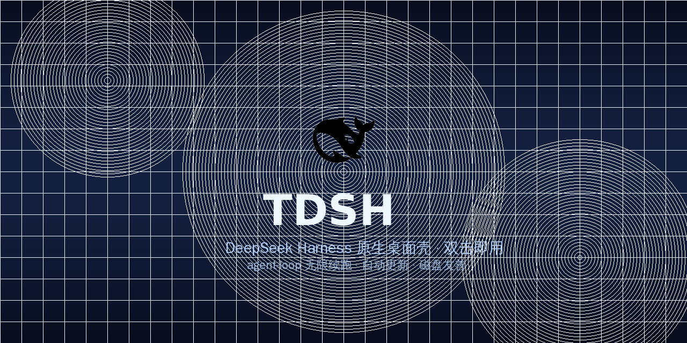
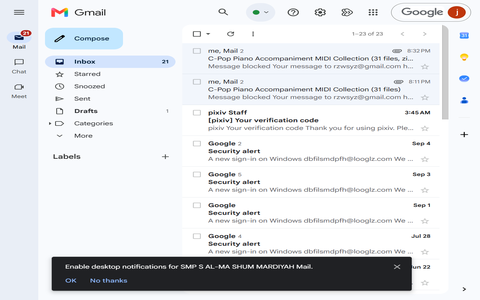

# TDSH — 团团的 DeepSeek 桌面壳

<p align="center">
  
</p>

> **T** = 团团（开发者）· **DSH** = DeepSeek Harness
>
> 把 DeepSeek Harness 的 Web 界面装进一个原生桌面窗口，双击即用，含自动更新与 agent-loop 无限续跑补丁。

<p align="center">
  
  
  
  
  
</p>

---

## 截图

<p align="center">
  
</p>

---

## 功能特性

| 特性 | 说明 |
|---|---|
| 🐋 **DeepSeek 鲸鱼闪屏** | 启动时显示官方鲸鱼 Logo + "探索未至之境" 动画，窗口加载完成后自动关闭 |
| 🔄 **一键自动更新** | 检测到新版本时弹出确认对话框，后台下载进度条 + 自动安装 |
| 📌 **版本标签** | 窗口右下角显示版本号（如 `v0.1.28`），点击可触发更新检查 |
| 🔗 **attach-or-spawn 模式** | 检测本地 `dsh web` 是否已运行：已运行则复用窗口，否则自动拉起新实例 |
| 🪟 **Hanako 式窗口交互** | 对话头部即拖拽区，右上角独立圆角胶囊内嵌最小化/最大化/关闭三键 |
| 🔒 **单实例锁** | 防止重复启动，关闭窗口自动回收子进程 |
| 💾 **磁盘友善** | 所有数据落盘在应用目录，不写系统盘 |

---

## 关键补丁：agent-loop 无限自动续跑

> ⚠️ **注意：此补丁不在 TDSH 安装包内，需手动应用。**
>
> 备份：`harness-patches/agent-loop/`（已推此仓库）

dsh 的 `ReactLoopAgent` 默认在模型产出无工具调用消息时 yield（等待用户输入）。
本补丁删除 `autoContinued` 守卫，改为**无限次注入 `[自动续跑]` 指令**——GPT/Claude 风格永不 yield。

### 验证结果（deepseek-v4-flash，2026-08-22）

| 指标 | 数值 |
|---|---|
| 连续运行时间 | 133+ 分钟 |
| 完成目标数 | 21 个 |
| 中途停止次数 | 0 |

模型完成一个目标 → `complete_goal` → `goal-complete-inject` → MCTS → 新目标 → 循环。
期间做了真实工作：修复炉石 JVM idle-halt、GameplayModeStrategy 投降回归、清理 11GB 磁盘、创建 UUMit 技能赚 UT 等。

---

## 安装

### Windows 安装包

1. 前往 [GitHub Releases](https://github.com/tuantuan0218/TDSH/releases) 下载最新版 `TDSH-Setup-x.x.x.exe`
2. 运行安装程序，按提示完成安装
3. 桌面启动 TDSH

### 开发模式运行

```bash
git clone https://github.com/tuantuan0218/TDSH.git
cd TDSH
pnpm install
npx electron . --no-sandbox
```

---

## 配置

`config.json` 位于应用根目录：

| 字段 | 说明 |
|---|---|
| `node` | 指定 Node.js 可执行文件路径（如 `H:\\nodejs\\v24.16.0\\node.exe`），用于启动 `dsh web` 后端服务 |
| `desktopPort` | HTTP carrier 监听端口，默认 `24000`，渲染进程插件通过 `dshDesktopPort` 读取 |

---

## 开发钩子

| 环境变量 | 行为 |
|---|---|
| `DSH_CAPTURE=1` | GUI 加载后截图 `capture.png` 并退出 |
| `DSH_MORPHCHECK=1` | 输出注入状态验证 JSON |
| `DSH_SETTINGSDUMP=1` | 打开设置页并输出注入验证 |
| `DSH_FORCE_SPAWN=1` | 强制自起新服务（不 attach） |
| `DSH_SHOT=1` | 截图验证（用于 CI 测试） |

---

## 更新流水线

```
启动检测 → electron-updater → 弹出确认框
  → 后台下载（进度条） → quitAndInstall
  → 自动替换 + 重启
```

构建安装包：
```bash
npx electron-builder --win --x64 --publish never
```

上传 Release：
```bash
gh release upload vx.x.x \
  dist/TDSH-Setup-x.x.x.exe \
  dist/latest.yml \
  dist/TDSH-Setup-x.x.x.exe.blockmap \
  --clobber
```

---

## 技术栈

- **Electron 33** — 桌面应用框架
- **dsh plugin architecture** — 插件化架构，客户端插件通过 HTTP carrier bridge 通信
- **electron-updater** — 自动更新机制
- **electron-builder** — NSIS 安装包构建
- **Node.js ≥ 22.19** — 后端服务运行环境

---

## 项目结构

```
TDSH/
├── main.js                 # Electron 主进程
├── preload.js              # 预加载脚本（已弃用，功能迁移至 HTTP carrier）
├── config.json             # 应用配置
├── electron-builder.yml    # 构建配置
├── assets/
│   ├── icon.ico            # 应用图标
│   ├── icon.png            # 应用图标（PNG）
│   ├── deepseek-whale.svg  # DeepSeek 鲸鱼 Logo（闪屏用）
│   ├── banner.png          # GitHub 仓库横幅图
│   └── screenshot-thumb.png # 应用截图（缩略图）
├── updater/
│   └── updater.cjs         # 更新检查模块
├── dsh-plugins/            # 客户端插件
│   └── dsh-update-btn/
│       └── lib/client.js   # 更新按钮插件
├── harness-patches/        # 手动补丁（含 agent-loop 无限续跑补丁）
└── dist/                   # 构建输出
    ├── TDSH-Setup-*.exe    # NSIS 安装包
    └── latest.yml          # 更新清单
```

---

## 贡献

欢迎！看 [CONTRIBUTING.md](CONTRIBUTING.md) 开始。
提 bug 用 [Bug 模板](.github/ISSUE_TEMPLATE/bug_report.yml)，提功能用 [Feature 模板](.github/ISSUE_TEMPLATE/feature_request.yml)。

---

## 商标声明

应用图标和闪屏使用的 **DeepSeek 鲸鱼 Logo** 版权归 DeepSeek 所有。本项目为非官方个人项目，与 DeepSeek 无隶属关系。图标仅作本地应用标识，不构成商标授权。

---

[MIT](LICENSE) © 2026 tuantuan0218
